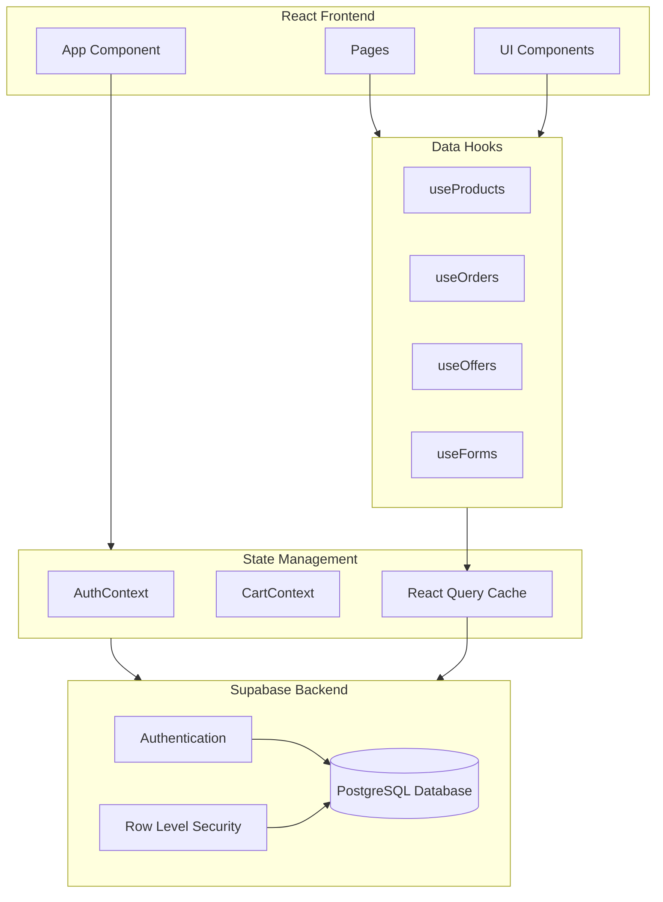
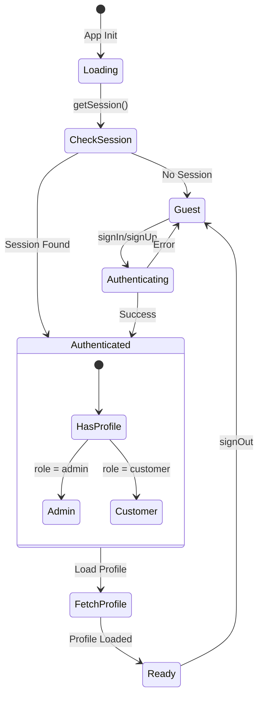
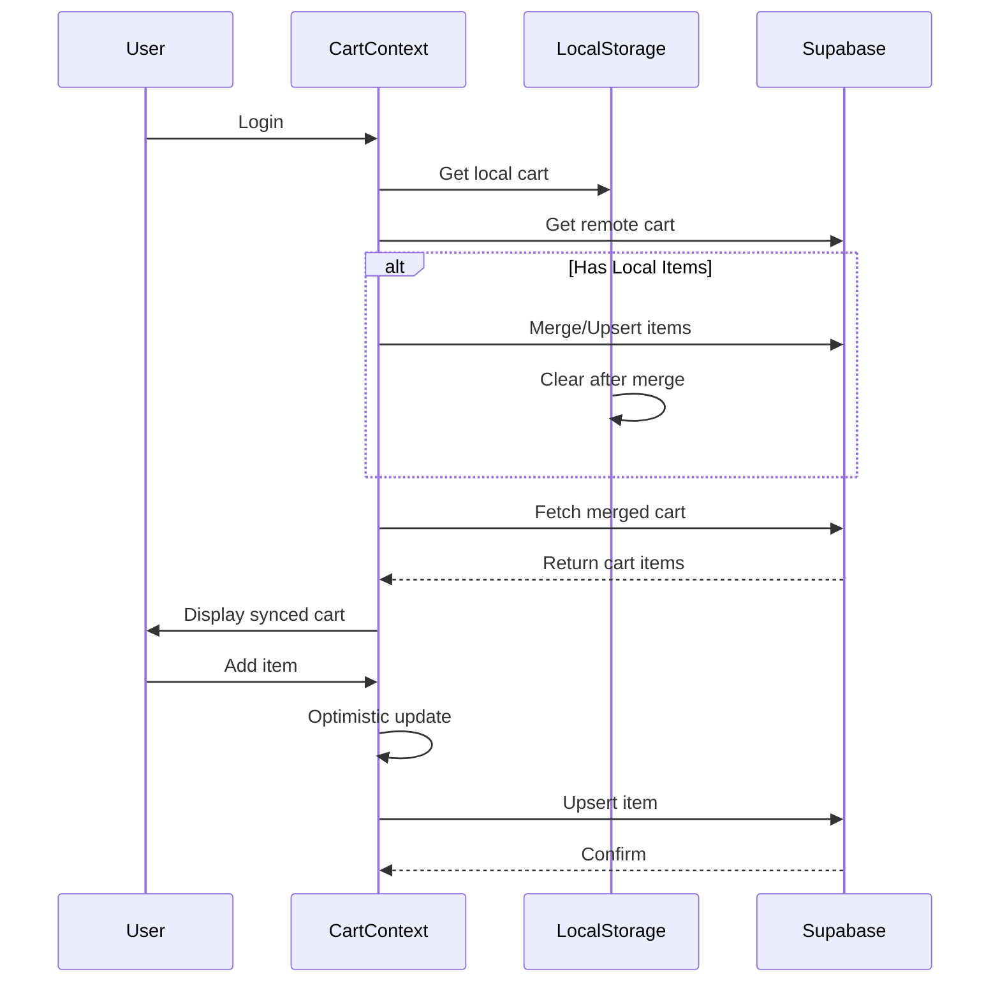
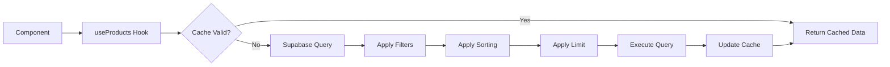
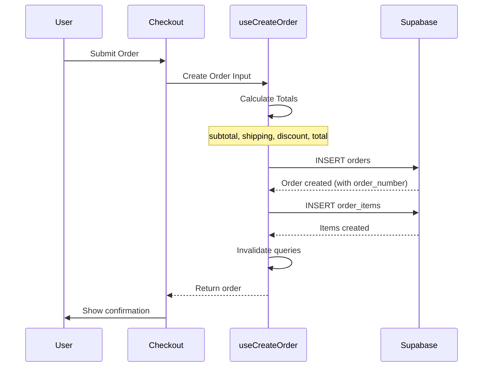
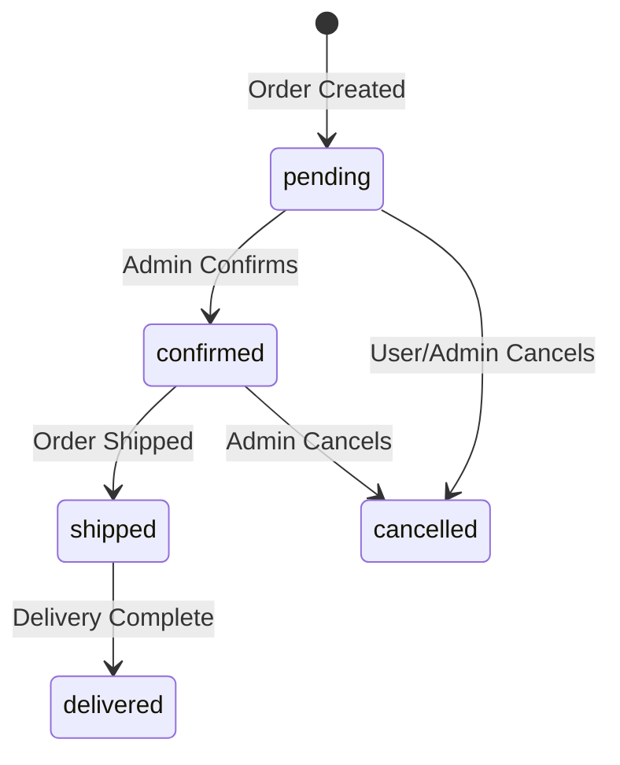
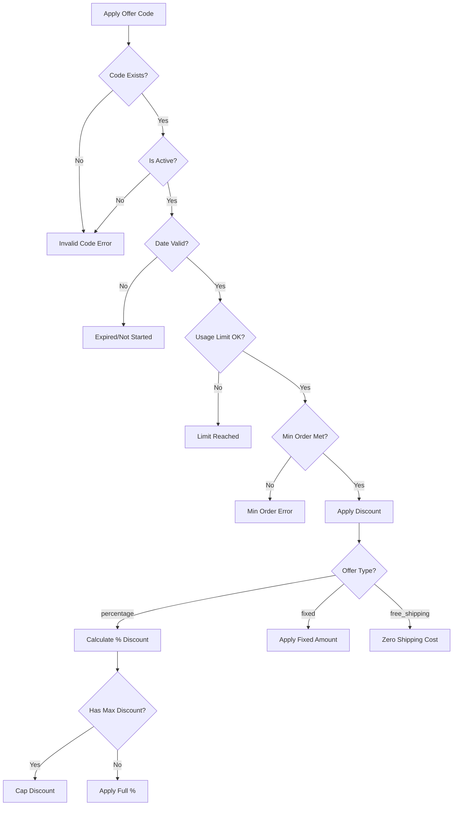
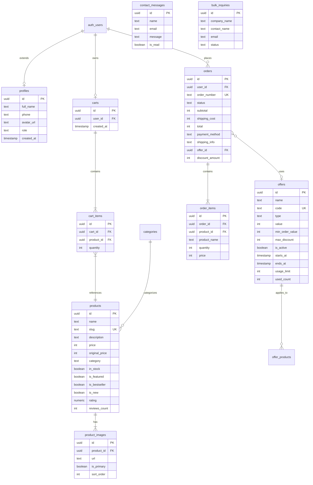
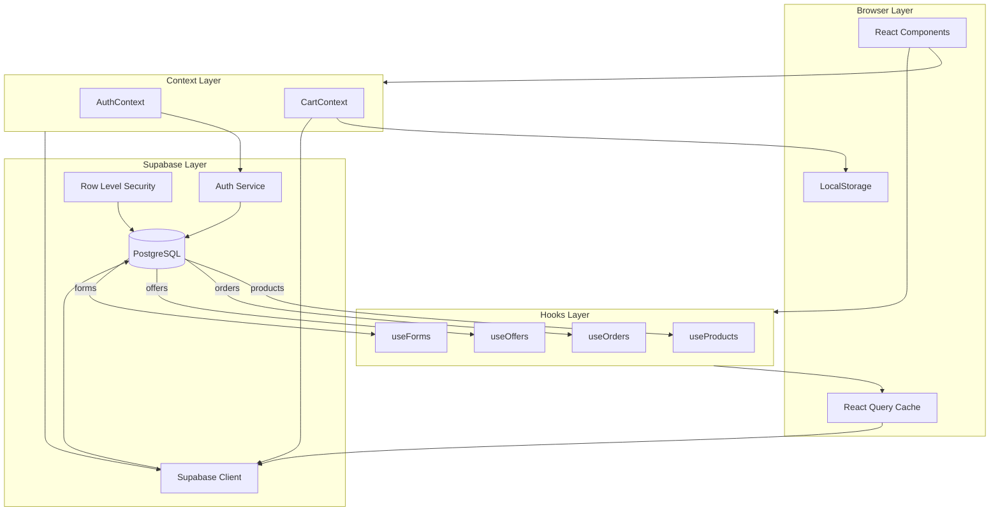
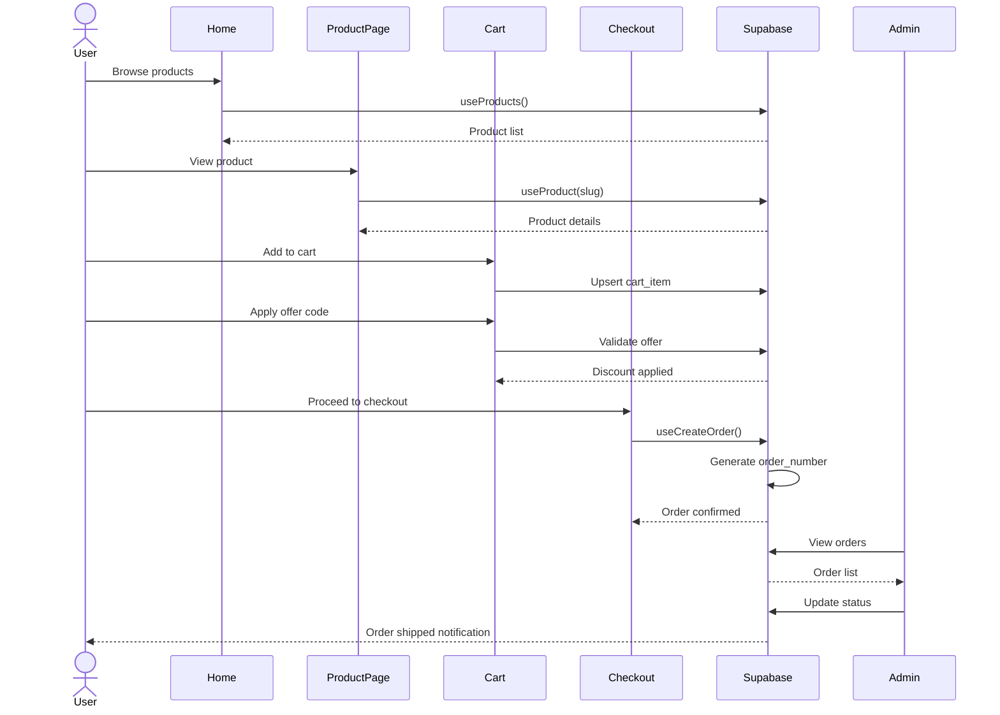

# Backend Technical Documentation

## Overview

This document provides comprehensive technical documentation for the **aonetop** e-commerce application backend. The application is built using React + Vite with Supabase as the Backend-as-a-Service (BaaS) provider, handling authentication, database operations, and real-time synchronization.

---

## Architecture Overview



---

## Module Documentation

### 1. Supabase Client Configuration

**File:** `src/lib/supabase.ts`

The Supabase client is the central connection point to the backend. It handles:

| Feature | Description |
|---------|-------------|
| Client Initialization | Creates typed Supabase client with auto-refresh tokens |
| Session Persistence | Maintains user sessions across browser restarts |
| URL Detection | Detects auth callbacks from OAuth providers |
| Type Helpers | Exports `Tables`, `InsertTables`, `UpdateTables` for typed queries |

```typescript
// Key exports
export const supabase = createClient<Database>(supabaseUrl, supabaseAnonKey);
export type Tables<T> = Database['public']['Tables'][T]['Row'];
export type InsertTables<T> = Database['public']['Tables'][T]['Insert'];
export type UpdateTables<T> = Database['public']['Tables'][T]['Update'];
```

---

### 2. Authentication Module

**File:** `src/contexts/AuthContext.tsx`

Manages user authentication state and profile data.

#### Functionality

| Function | Description |
|----------|-------------|
| `signUp` | Register new user with email, password, and full name |
| `signIn` | Authenticate user with email/password |
| `signOut` | Log out user with timeout protection and local storage cleanup |
| `updateProfile` | Update user profile information |
| `fetchProfile` | Retrieve user profile from `profiles` table |

#### Auth State Flow



#### Key Features
- **Auto-creates profile** on signup via database trigger
- **Admin detection** via `profile.role === 'admin'`
- **Timeout protection** to prevent hanging signOut calls

---

### 3. Cart Module

**File:** `src/contexts/CartContext.tsx`

Manages shopping cart with hybrid local/remote storage.

#### State Structure

```typescript
interface CartState {
  items: CartItem[];        // Cart items with product details
  isOpen: boolean;          // Cart drawer visibility
  appliedOffer: Offer;      // Applied discount coupon
}
```

#### Cart Operations

| Operation | Guest Mode | Authenticated Mode |
|-----------|------------|-------------------|
| Add Item | localStorage | Supabase + localStorage sync |
| Remove Item | localStorage | Supabase delete |
| Update Quantity | localStorage | Supabase update |
| Clear Cart | localStorage | Supabase delete all |
| Apply Offer | Local state | Local state + validation |

#### Cart Synchronization Workflow



---

### 4. Products Module

**File:** `src/hooks/useProducts.ts`

Handles product catalog operations using React Query.

#### Exported Hooks

| Hook | Purpose | Query Key |
|------|---------|-----------|
| `useProducts` | Fetch all products with filters/sorting | `['products', filters, sortBy, limit]` |
| `useProduct` | Fetch single product by slug or ID | `['product', identifier]` |
| `useFeaturedProducts` | Fetch featured products | Uses `useProducts` |
| `useBestsellers` | Fetch bestseller products | Uses `useProducts` |
| `useNewProducts` | Fetch new arrivals | Uses `useProducts` |
| `useCategories` | Fetch all categories | `['categories']` |

#### Filter Options

```typescript
interface ProductFilters {
  category?: string;      // Filter by category
  search?: string;        // Search in name/description
  inStock?: boolean;      // Stock availability
  isFeatured?: boolean;   // Featured products only
  isBestseller?: boolean; // Bestsellers only
  isNew?: boolean;        // New arrivals only
}
```

#### Product Query Flow



---

### 5. Orders Module

**File:** `src/hooks/useOrders.ts`

Handles order creation and management.

#### Exported Hooks

| Hook | Type | Purpose |
|------|------|---------|
| `useOrders` | Query | Fetch current user's orders |
| `useOrder` | Query | Fetch single order by ID |
| `useOrderByNumber` | Query | Fetch order by order number |
| `useCreateOrder` | Mutation | Create new order |
| `useAdminOrders` | Query | Fetch all orders (admin) |
| `useUpdateOrderStatus` | Mutation | Update order status (admin) |

#### Order Creation Flow



#### Order Lifecycle



---

### 6. Offers Module

**File:** `src/hooks/useOffers.ts`

Manages promotional offers and discount codes.

#### Exported Hooks

| Hook | Purpose |
|------|---------|
| `useOffers` | Fetch active, valid offers |
| `useAdminOffers` | Fetch all offers (including inactive) |
| `useOfferByCode` | Validate specific offer code |
| `useCreateOffer` | Create new offer |
| `useUpdateOffer` | Update existing offer |
| `useDeleteOffer` | Delete offer |

#### Offer Validation Flow



---

### 7. Forms Module

**File:** `src/hooks/useForms.ts`

Handles form submissions for contact and bulk inquiries.

#### Exported Hooks

| Hook | Table | Fields |
|------|-------|--------|
| `useSubmitContactForm` | `contact_messages` | name, email, phone, subject, message |
| `useSubmitBulkInquiry` | `bulk_inquiries` | company_name, contact_name, email, phone, business_type, volume, products, message |

---

## Database Schema

### Entity Relationship Diagram



### Tables Summary

| Table | Purpose | Key Fields |
|-------|---------|------------|
| `profiles` | User profile info | role (customer/admin) |
| `products` | Product catalog | price in paise, flags for featured/bestseller/new |
| `product_images` | Product gallery | is_primary flag |
| `categories` | Product categories | sort_order for display |
| `carts` | User shopping carts | One per user (unique) |
| `cart_items` | Cart contents | Unique per cart+product |
| `orders` | Order records | Auto-generated order_number |
| `order_items` | Order line items | Denormalized product info |
| `offers` | Discount codes | Type: percentage/fixed/free_shipping |
| `offer_products` | Offer-product mapping | For targeted offers |
| `contact_messages` | Contact form submissions | is_read for admin tracking |
| `bulk_inquiries` | B2B inquiries | Status workflow |

---

## Complete Data Flow Architecture



---

## User Journey Flows

### Complete Purchase Flow



---

## API Integration Summary

### Supabase Tables Used

| Module | Tables Accessed | Operations |
|--------|-----------------|------------|
| Auth | `profiles`, `auth.users` | SELECT, UPDATE |
| Cart | `carts`, `cart_items`, `products`, `product_images` | SELECT, INSERT, UPDATE, DELETE |
| Products | `products`, `product_images`, `categories` | SELECT |
| Orders | `orders`, `order_items` | SELECT, INSERT, UPDATE |
| Offers | `offers` | SELECT, INSERT, UPDATE, DELETE |
| Forms | `contact_messages`, `bulk_inquiries` | INSERT |

### Environment Variables

```bash
VITE_SUPABASE_URL=https://your-project.supabase.co
VITE_SUPABASE_ANON_KEY=your-anon-key
```

---

## Database Triggers & Functions

| Trigger/Function | Table | Purpose |
|------------------|-------|---------|
| `handle_new_user` | `auth.users` | Auto-creates profile on signup |
| `generate_order_number` | `orders` | Auto-generates order number (ORD-YYYY-XXXX) |
| `update_updated_at` | `orders` | Updates `updated_at` timestamp on order changes |

---

## Security Model

All data access is controlled via Supabase Row Level Security (RLS) policies:

- **Profiles**: Users can only read/update their own profile
- **Carts**: Users can only access their own cart
- **Orders**: Users see only their orders; admins see all
- **Products/Categories**: Public read access
- **Offers**: Public read for active offers; admin full access
- **Contact/Inquiries**: Insert-only for public; admin read access

---

## Technology Stack

| Layer | Technology |
|-------|------------|
| Frontend | React 18, TypeScript, Vite |
| State Management | React Context, React Query (TanStack) |
| Backend | Supabase (PostgreSQL, Auth, Storage) |
| Styling | Tailwind CSS, shadcn/ui |
| Routing | React Router |
