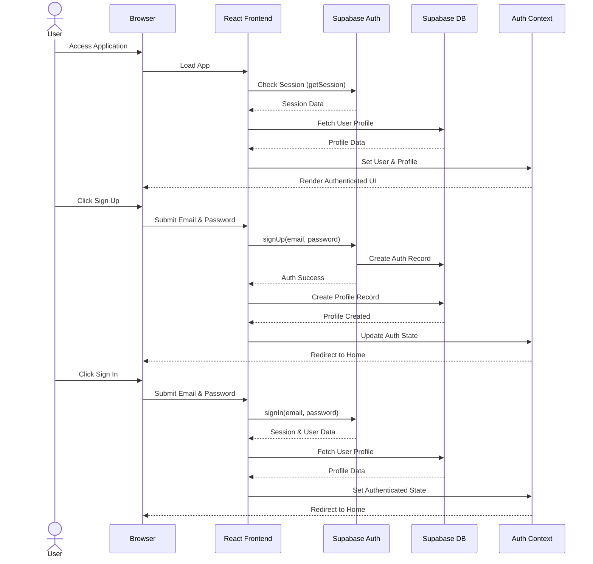
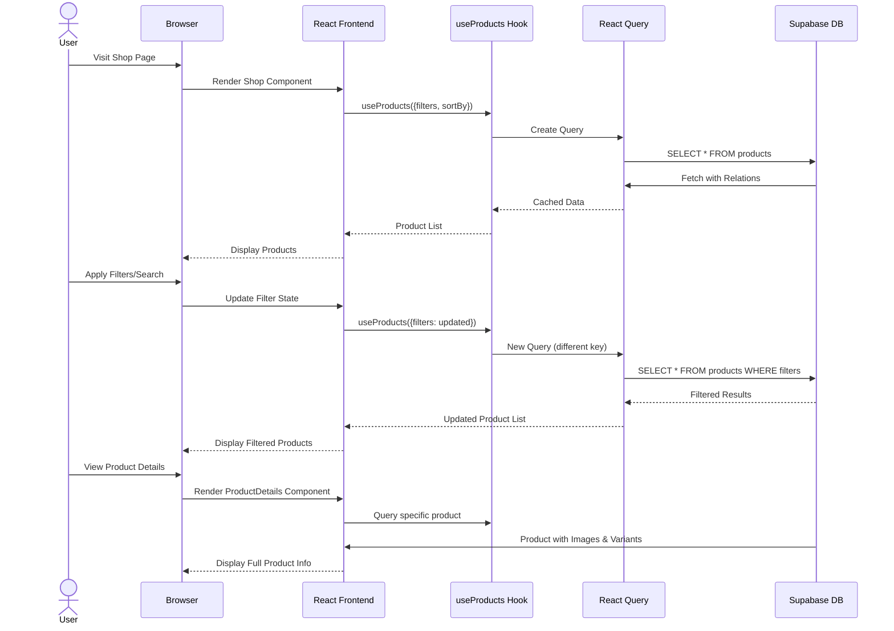
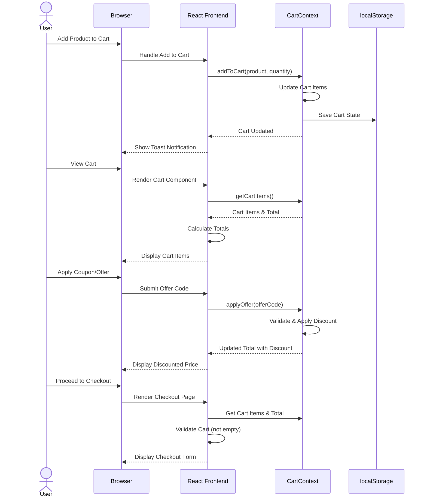
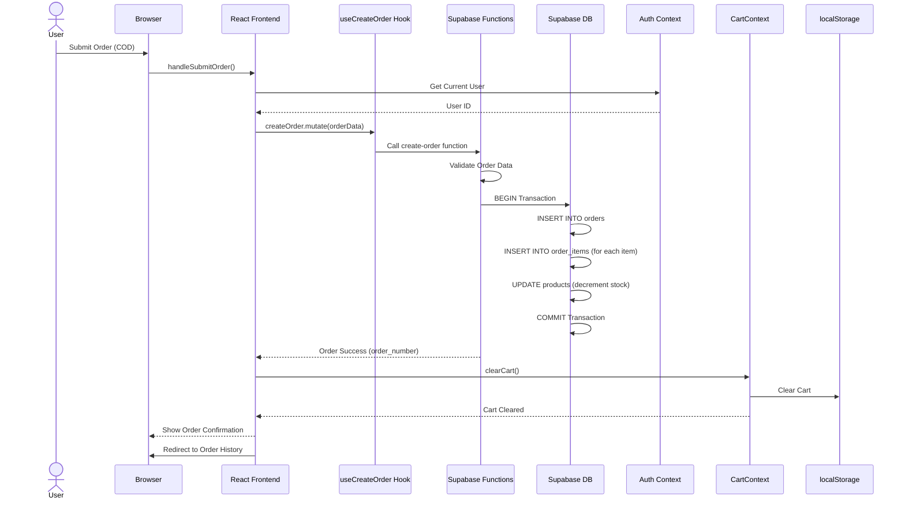
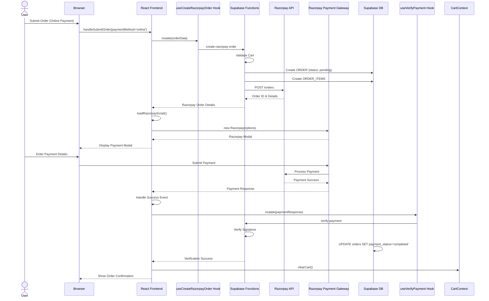
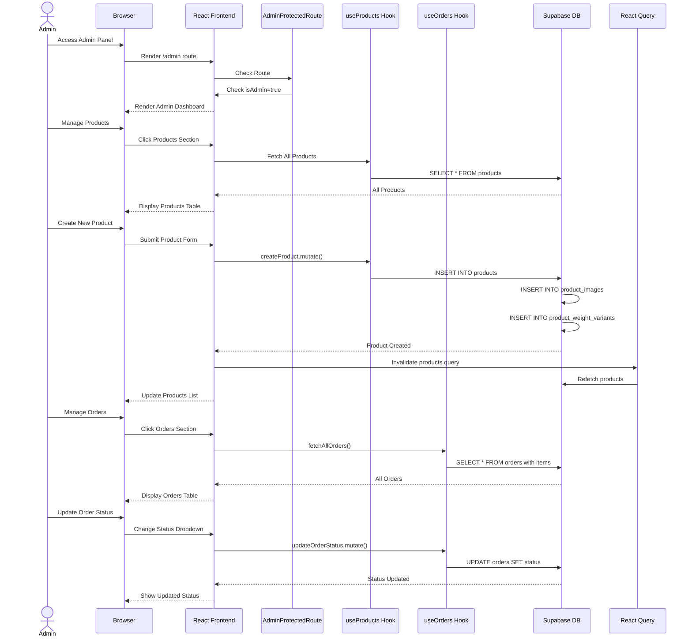
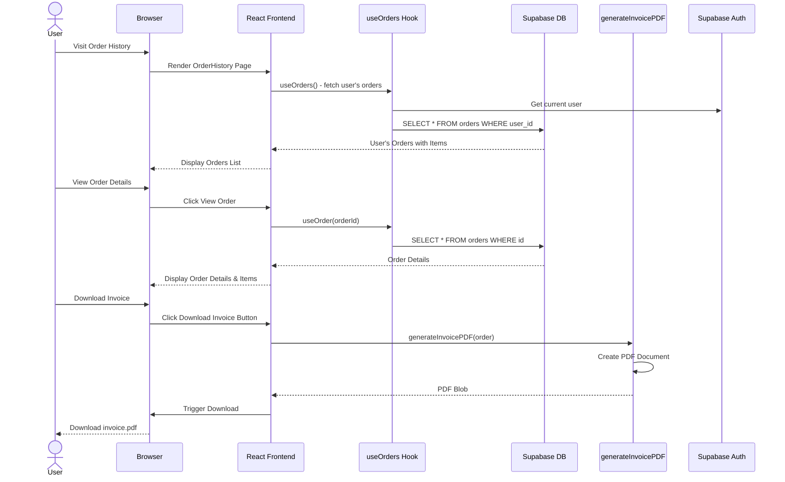
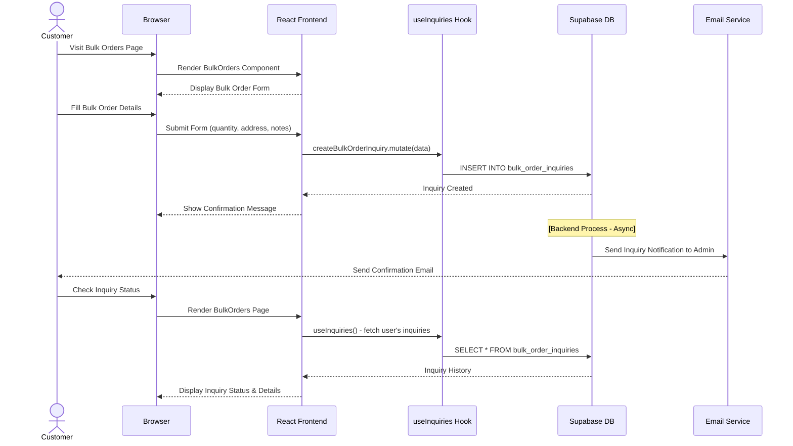
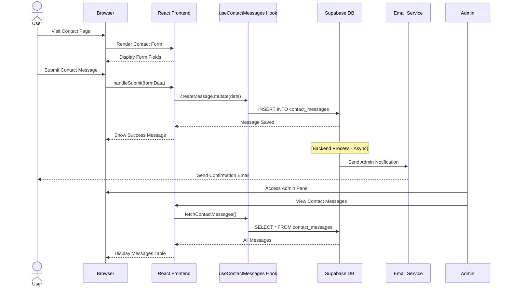
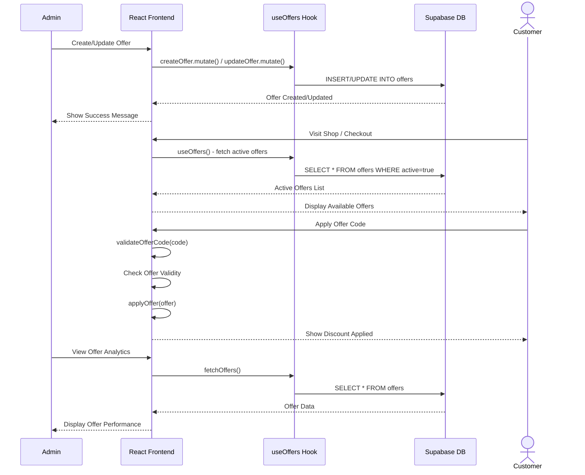

# Aonetop API Flow Diagrams

## 1. Authentication Flow

## 2. Product Discovery & Browsing Flow

## 3. Shopping Cart & Checkout Flow

## 4. Order Creation & Payment Flow (COD)

## 5. Razorpay Payment Flow

## 6. Admin Operations Flow

## 7. Order History & Invoice Flow

## 8. Bulk Orders Flow

## 9. Contact & Support Flow

## 10. Offers & Promotions Flow

## API Endpoints Summary

### Authentication Endpoints
- `POST /auth/signup` - User registration
- `POST /auth/signin` - User login
- `POST /auth/signout` - User logout
- `GET /auth/session` - Get current session

### Product Endpoints
- `GET /products` - List all products with filters
- `GET /products/:id` - Get product details
- `GET /product_images` - Get product images
- `GET /product_weight_variants` - Get weight variants

### Order Endpoints
- `GET /orders` - Get user orders
- `GET /orders/:id` - Get order details
- `POST /orders` - Create order (COD)
- `PUT /orders/:id` - Update order status (Admin)
- `GET /order_items` - Get order items

### Payment Endpoints
- `POST /functions/create-razorpay-order` - Create Razorpay order
- `POST /functions/verify-payment` - Verify Razorpay payment
- `PUT /payment_records/:id` - Update payment status

### Admin Endpoints
- `POST /products` - Create product
- `PUT /products/:id` - Update product
- `DELETE /products/:id` - Delete product
- `POST /product_images` - Upload product images
- `POST /product_weight_variants` - Create weight variants

### Contact & Inquiry Endpoints
- `POST /contact_messages` - Submit contact form
- `GET /contact_messages` - Get contact messages (Admin)
- `POST /bulk_order_inquiries` - Submit bulk order inquiry
- `GET /bulk_order_inquiries` - Get inquiries (Admin/User)

### Offer Endpoints
- `GET /offers` - Get active offers
- `POST /offers` - Create offer (Admin)
- `PUT /offers/:id` - Update offer (Admin)
- `DELETE /offers/:id` - Delete offer (Admin)

## Data Flow Patterns

### 1. Query Pattern (Read Operations)
- Frontend Hook → React Query → Supabase DB → Cache → Component → UI

### 2. Mutation Pattern (Write Operations)
- Frontend Hook → useM utation → Supabase DB/Function → Success/Error → Query Invalidation → Refetch

### 3. Async Operations
- User Action → Frontend State Update → API Call → Loading State → Success/Error Handler → UI Update

### 4. Authentication Pattern
- Session Check → User Profile Fetch → Auth Context Update → Route Protection → Feature Access
