# Aonetop Process Flow Diagrams

## 1. User Registration & Authentication Process

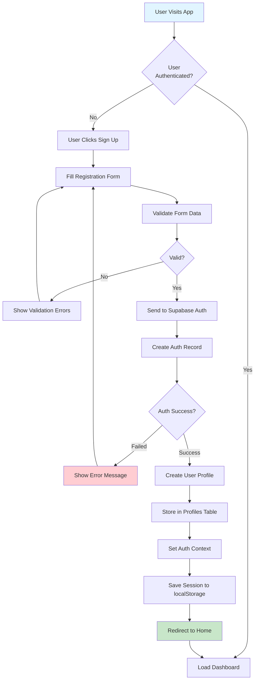

## 2. User Login Process

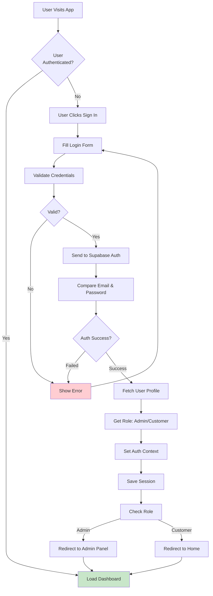

## 3. Product Browsing & Filtering Process

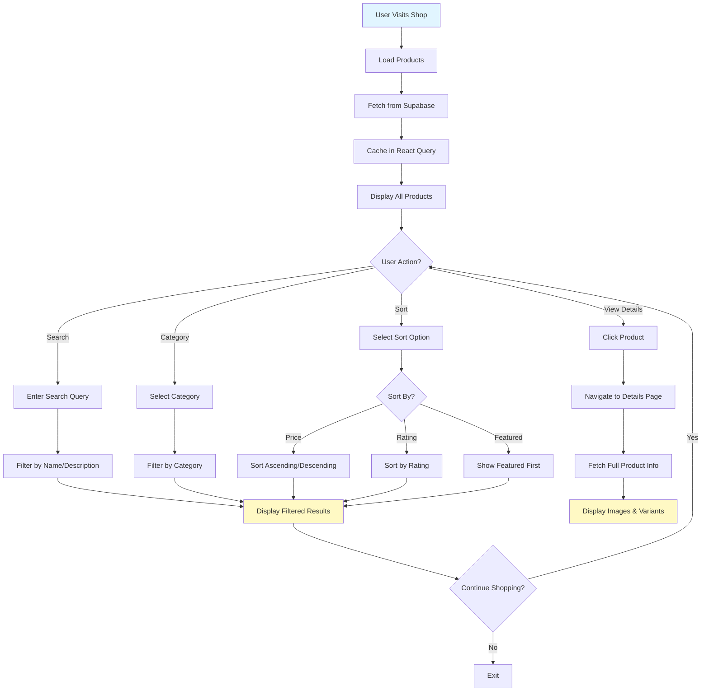

## 4. Shopping Cart Management Process

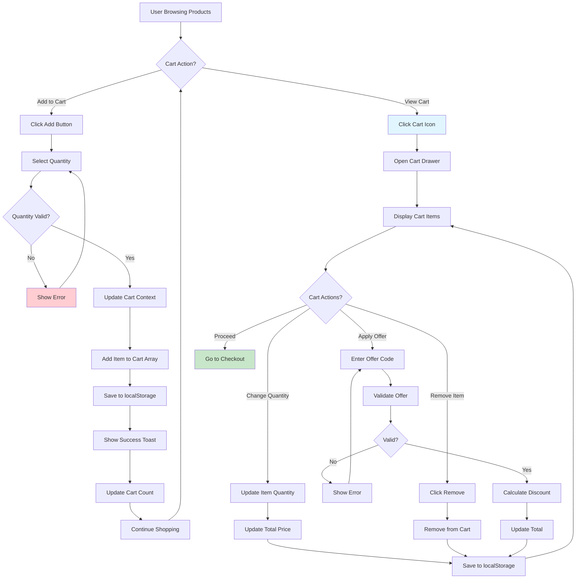

## 5. Checkout & Order Creation Process (COD)

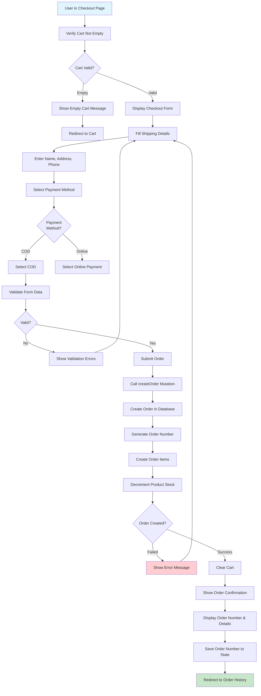

## 6. Online Payment Process (Razorpay)

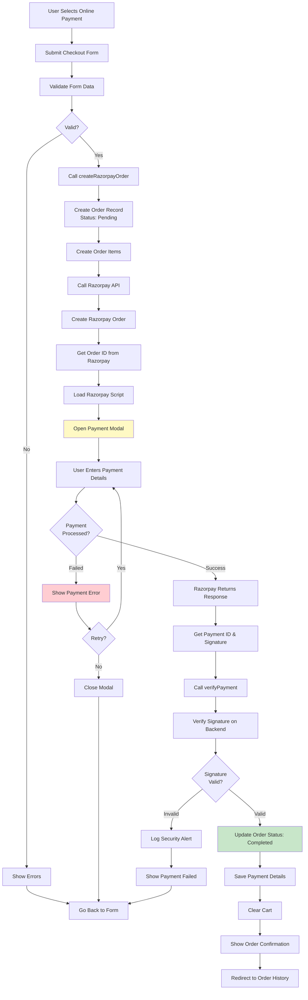

## 7. Admin Order Management Process

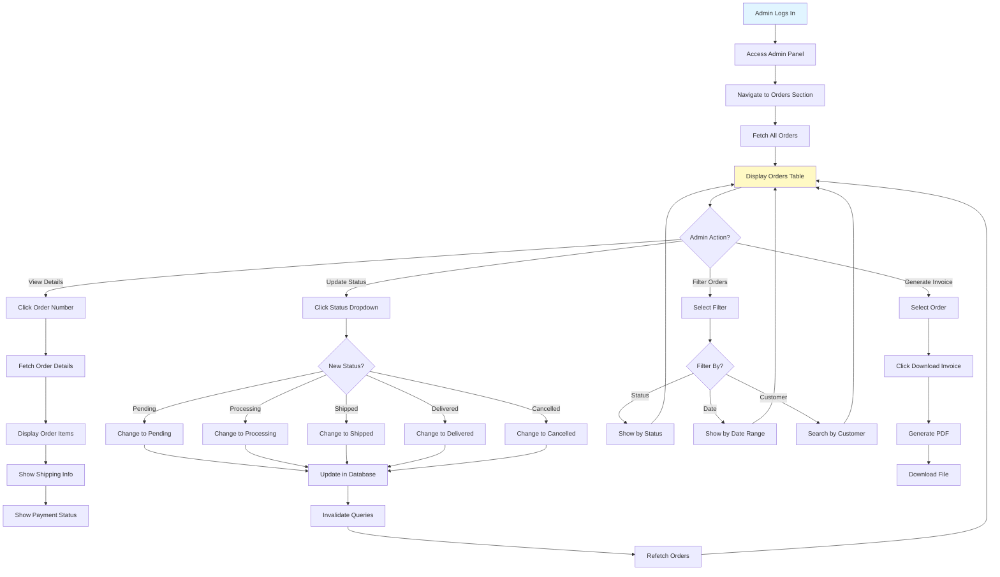

## 8. Product Management Process (Admin)

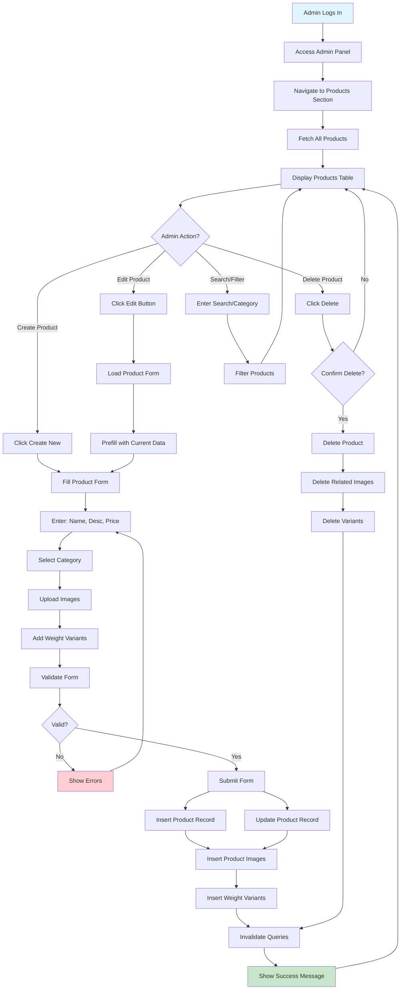

## 9. Bulk Order Inquiry Process

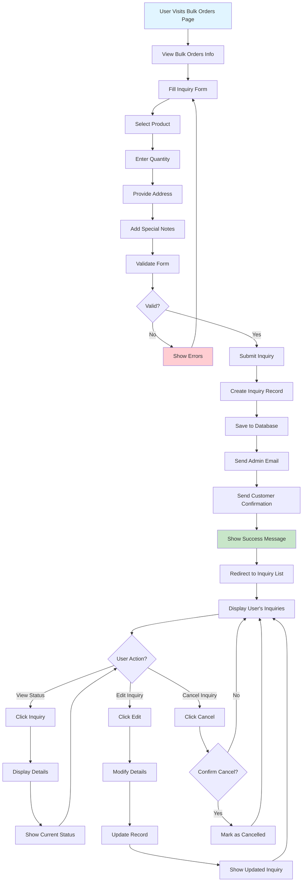

## 10. Contact Message Process

```mermaid
flowchart TD
    A[User Visits Contact Page] --> B[View Contact Form]
    B --> C[Fill Contact Details]
    C --> D[Enter: Name, Email, Subject, Message]
    D --> E[Validate Form]
    E --> F{Valid?}
    F -->|No| G[Show Validation Errors]
    G --> C
    
    F -->|Yes| H[Submit Message]
    H --> I[Insert into Database]
    I --> J[Send Admin Email]
    J --> K[Send Customer Confirmation]
    K --> L[Show Success Message]
    
    L --> M{User Action?}
    M -->|Back to Home| N[Redirect to Home]
    M -->|Continue| O[Clear Form]
    O --> B
    
    N --> P[End]
    
    note over J,K[Async Email Service]
    
    style A fill:#e1f5ff
    style L fill:#c8e6c9
    style G fill:#ffcdd2
```

## 11. Offer & Coupon Management Process

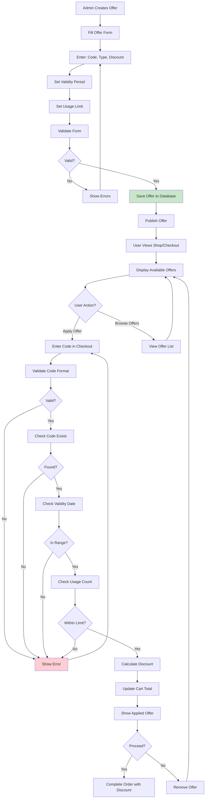

## 12. Notification Flow Process

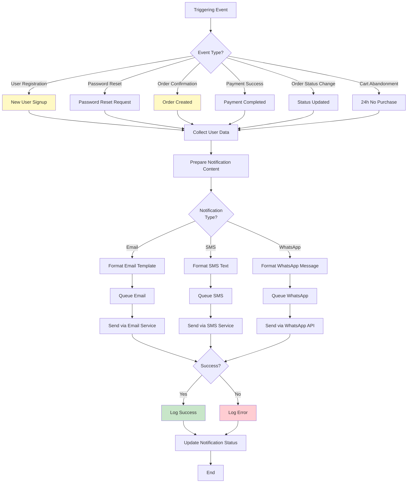

## 13. Product Categorization Hierarchy

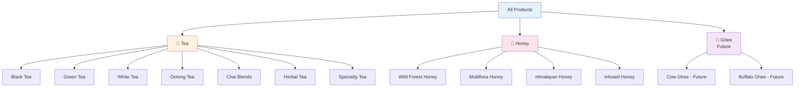

## 14. Inventory Management Process

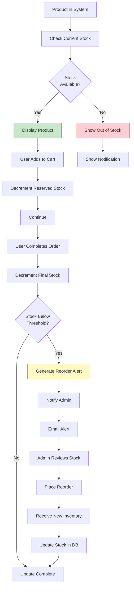

## 15. Analytics & Reporting Process

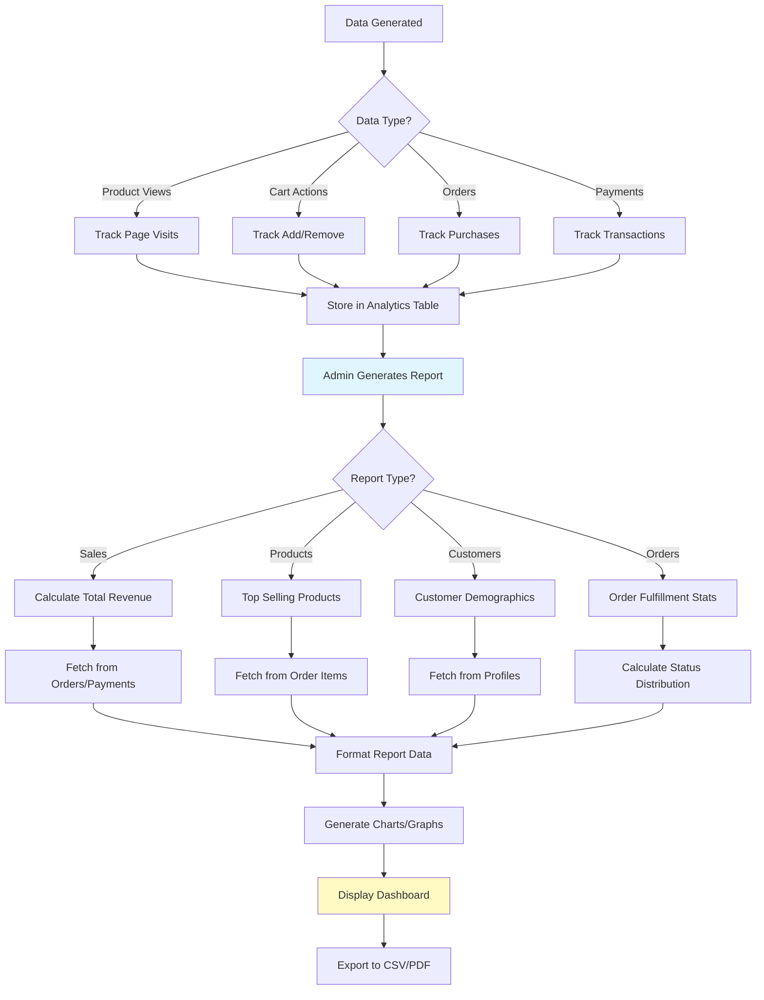

## Process Flow Legend

| Symbol | Meaning |
|--------|---------|
| Rounded Rectangle | Start/End Point |
| Rectangle | Process/Action |
| Diamond | Decision Point |
| Arrow | Flow Direction |
| Color Blue | Start Point |
| Color Yellow | Data Display |
| Color Green | Success/Complete |
| Color Red | Error/Failure |

## Key Process Milestones

### Customer Journey Milestones
1. ✅ User Registration → Complete
2. ✅ Product Browsing → Complete
3. ✅ Shopping Cart → Complete
4. ✅ Checkout (COD) → Complete
5. ✅ Payment (Razorpay) → Complete
6. ✅ Order Confirmation → Complete
7. 🔄 Notifications → In Progress
8. 📋 Order Tracking → Implemented
9. 📦 Bulk Orders → Implemented
10. 💬 Contact Support → Implemented

### Admin Journey Milestones
1. ✅ Admin Login → Complete
2. ✅ Product Management → Complete
3. ✅ Order Management → Complete
4. ✅ Offer Management → Complete
5. 📊 Analytics Dashboard → Planned
6. 📧 Notification Management → Planned
7. 🎯 Customer Insights → Planned

## Critical Paths

### Sales Critical Path
User Signup → Browse Products → Add to Cart → Checkout → Payment → Order Confirmation → Notification

### Admin Critical Path
Admin Login → Inventory Check → Order Processing → Fulfillment → Shipping Updates → Customer Notification
