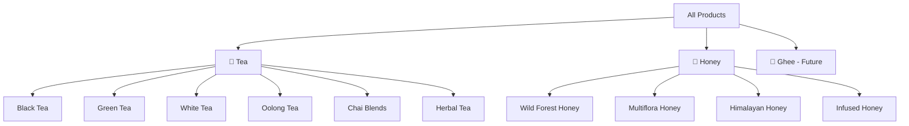
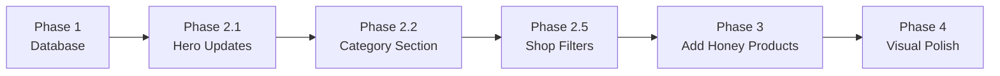

# Product Categorization & Multi-Product UI Strategy

**Goal**: Transform the current tea-only website into a multi-product platform featuring **Tea** and **Honey** as the primary product categories (with Ghee as a future addition).

---

## Current State Analysis

The website is currently entirely tea-focused with the following structure:

### Database Layer
- `categories` table stores tea-specific categories (Black Tea, Green Tea, etc.)
- `products` table uses a `category` TEXT field tied to tea types
- No concept of "product lines" or parent categories

### Frontend Components
| Component | Current Tea Focus |
|-----------|-------------------|
| [Hero.tsx](file:///home/hackycoder/my_Data/aonetop/src/components/home/Hero.tsx) | "Discover the Art of Tea" headline, tea leaf imagery |
| [ShopByCategory.tsx](file:///home/hackycoder/my_Data/aonetop/src/components/home/ShopByCategory.tsx) | 6 hardcoded tea categories |
| [products.ts](file:///home/hackycoder/my_Data/aonetop/src/data/products.ts) | 12 tea products, 8 tea categories |
| Stats Section | "50+ Tea Varieties" |

---

## Proposed Product Hierarchy



---

## Phase 1: Database Schema Updates

### 1.1 Add Product Line Concept

**New Migration**: Create a `product_line` field to distinguish Tea vs Honey vs Ghee.

```sql
-- Add product_line column to products table
ALTER TABLE products ADD COLUMN product_line TEXT DEFAULT 'tea';

-- Update existing products
UPDATE products SET product_line = 'tea';

-- Add check constraint
ALTER TABLE products ADD CONSTRAINT chk_product_line 
  CHECK (product_line IN ('tea', 'honey', 'ghee'));

-- Create index for faster filtering
CREATE INDEX idx_products_product_line ON products(product_line);
```

### 1.2 Update Categories Table

```sql
-- Add product_line to categories to group them
ALTER TABLE categories ADD COLUMN product_line TEXT DEFAULT 'tea';

-- Insert honey categories
INSERT INTO categories (id, name, description, sort_order, product_line) VALUES
  ('wild-forest', 'Wild Forest Honey', 'Raw honey from pristine forests', 10, 'honey'),
  ('multiflora', 'Multiflora Honey', 'Blend from diverse wildflowers', 11, 'honey'),
  ('himalayan', 'Himalayan Honey', 'High-altitude mountain honey', 12, 'honey'),
  ('infused-honey', 'Infused Honey', 'Honey with herbs and spices', 13, 'honey');
```

---

## Phase 2: Frontend UI Changes

### 2.1 Homepage Hero Section

**File**: [Hero.tsx](file:///home/hackycoder/my_Data/aonetop/src/components/home/Hero.tsx)

| Element | Current | Proposed |
|---------|---------|----------|
| Headline | "Discover the Art of Tea" | "Nature's Finest: Tea & Honey" |
| Subtext | Tea gardens reference | "From India's finest tea gardens and pristine forest apiaries" |
| Image | Tea leaves | Split image OR rotating carousel of tea/honey |
| Stats | 50+ Tea Varieties | "50+ Tea Varieties • 15+ Honey Varieties" |
| Badge | 100% Organic | Keep as-is (applies to both) |

### 2.2 Shop By Category Section

**File**: [ShopByCategory.tsx](file:///home/hackycoder/my_Data/aonetop/src/components/home/ShopByCategory.tsx)

**Option A: Tabbed Categories** *(Recommended)*

```
┌─────────────────────────────────────────────────────────┐
│  [🍵 Tea]  [🍯 Honey]                                    │
├─────────────────────────────────────────────────────────┤
│  ┌─────────┐  ┌─────────┐  ┌─────────┐  ┌─────────┐    │
│  │ Black   │  │ Green   │  │ Chai    │  │ Herbal  │    │
│  │ Tea     │  │ Tea     │  │ Blends  │  │ Tea     │    │
│  └─────────┘  └─────────┘  └─────────┘  └─────────┘    │
└─────────────────────────────────────────────────────────┘
```

**Option B: Mega Categories with Sub-sections**

```
┌─────────────────────────────────────────────────────────┐
│             SHOP BY CATEGORY                            │
├─────────────────────────────────────────────────────────┤
│  🍵 PREMIUM TEAS              │  🍯 ORGANIC HONEY       │
│  ┌─────────┐  ┌─────────┐    │  ┌─────────┐  ┌─────────┐│
│  │ Black   │  │ Green   │    │  │ Wild    │  │ Multi   ││
│  │ Tea     │  │ Tea     │    │  │ Forest  │  │ flora   ││
│  └─────────┘  └─────────┘    │  └─────────┘  └─────────┘│
└─────────────────────────────────────────────────────────┘
```

### 2.3 Featured Products Section

**File**: [FeaturedProducts.tsx](file:///home/hackycoder/my_Data/aonetop/src/components/home/FeaturedProducts.tsx)

- Mix tea and honey products in featured section
- Add product line badge/tag on product cards (e.g., "TEA" | "HONEY")

### 2.4 Navigation Updates

**Files**: Layout components in `/src/components/layout/`

| Current Nav | Proposed Nav |
|-------------|--------------|
| Shop | Shop → dropdown with "All", "Tea", "Honey" |

### 2.5 Shop Page Filters

**File**: [Shop.tsx](file:///home/hackycoder/my_Data/aonetop/src/pages/Shop.tsx)

- Add "Product Line" filter section at top (Tea / Honey / All)
- Categories filter becomes dynamic based on selected product line

---

## Phase 3: Product Interface Updates

### 3.1 Update TypeScript Types

**File**: [products.ts](file:///home/hackycoder/my_Data/aonetop/src/data/products.ts)

```typescript
export type ProductLine = 'tea' | 'honey' | 'ghee';

export interface Product {
  // ... existing fields
  productLine: ProductLine;
  // For honey: replace brewingInstructions with usageRecommendations
  usageInfo?: {
    bestWith?: string;      // "Warm milk, toast, desserts"
    servingSize?: string;   // "1 tablespoon"
    storage?: string;       // "Cool, dry place"
  };
}
```

### 3.2 Create Honey Products Data

Sample honey products to add:

| Product Name | Category | Price (₹) | Description |
|--------------|----------|-----------|-------------|
| Wild Forest Honey | Wild Forest | 799 | Raw, unprocessed from Himalayan forests |
| Multiflora Valley | Multiflora | 599 | Blend from diverse wildflower meadows |
| Himalayan High Altitude | Himalayan | 999 | Collected above 8000 ft |
| Ginger Infused Honey | Infused | 699 | Immunity boosting blend |
| Tulsi Infused Honey | Infused | 699 | Ayurvedic wellness blend |
| Raw Organic Wildflower | Multiflora | 549 | Everyday premium honey |

---

## Phase 4: Visual & Branding Considerations

### 4.1 Color Palette Additions

| Product Line | Primary Color | Usage |
|--------------|---------------|-------|
| Tea | Current theme (red/deep tones) | Category badges, filters |
| Honey | Amber/Golden `#F5A623` | Category badges, filters |

### 4.2 Iconography

- Tea: 🍵 or leaf icon (existing)
- Honey: 🍯 or honeycomb/bee icon (new)

### 4.3 Product Card Variations

Add subtle visual distinction:
- Tea products: Current design
- Honey products: Golden accent border or badge

---

## Files Impacted Summary

| Area | Files to Modify |
|------|-----------------|
| **Database** | New migration `003_product_lines.sql` |
| **Types** | `src/data/products.ts`, `src/lib/supabase.ts` (types) |
| **Hooks** | `src/hooks/useProducts.ts` (add productLine filter) |
| **Homepage** | `Hero.tsx`, `ShopByCategory.tsx`, `FeaturedProducts.tsx`, `Bestsellers.tsx` |
| **Shop** | `Shop.tsx` (filters) |
| **Product Details** | `ProductDetails.tsx` (conditional rendering for honey info) |
| **Navigation** | `Header.tsx` or similar layout component |
| **Admin** | Product management forms (add productLine field) |

---

## Implementation Order (Recommended)



1. **Database Schema** - Add product_line support
2. **Homepage Hero** - Update messaging for dual focus
3. **Category Section** - Implement tabbed or split view
4. **Shop Page** - Add product line filter
5. **Product Data** - Insert honey products
6. **Visual Polish** - Color accents and badges

---

## Out of Scope (Future)

- **Traditional Ghee**: To be added in a future phase following similar pattern
- **Gift Bundles**: Mixed tea + honey combinations
- **Subscription boxes**: Monthly variety packs

---

## Questions for Decision

> [!IMPORTANT]
> Please confirm or provide feedback on:

1. **Category Display Style**: Do you prefer **Option A (Tabs)** or **Option B (Split Grid)** for the ShopByCategory section?

2. **Hero Treatment**: Should the hero be:
   - Static with dual messaging?
   - Rotating carousel between tea and honey visuals?
   - Split screen design?

3. **Honey Categories**: Are the proposed categories (Wild Forest, Multiflora, Himalayan, Infused) correct, or do you have specific honey types in mind?

4. **Branding**: Should honey have a distinct golden accent theme, or stay consistent with the current site colors?
